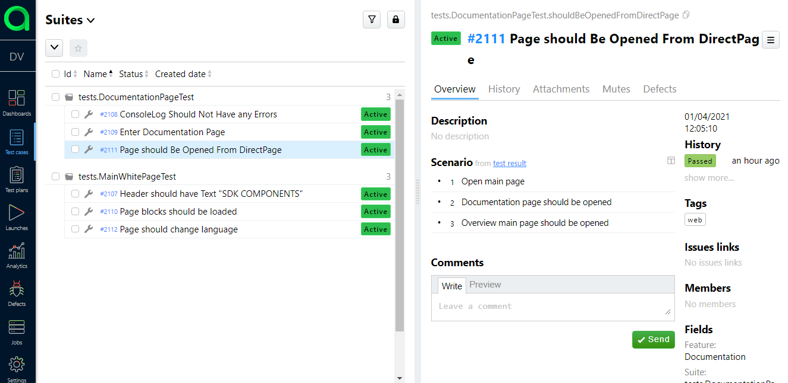

# Tests for expload.com website
## UI tests:
- Main page tests
- Page should Be Opened From DirectPage
- Console Log Should Not Have any Errors
- Header should have Text "SDK COMPONENTS"
- Page should change language EN/RU
- Download readme file from GitHub

## Technology Stack
- Java
- Gradle
- Junit5 + multi-threading runs
- Selenide (Automation framework based on Selenium)
- Selenoid (Virtualization system based on the docker)
- Allure (+Allure test ops) test report system.
- Jira integration / Jenkins integration
- Telegram piechart reporting library integration

## Screenshots
#### *Jenkins - it is an open source automation server:*

#### *Allure Report - it is a flexible lightweight test report tool:*

#### *Telegram notifications:*

#### *Allure TestOps - it is a TMS that allows to manage all test related stuff in one place:*
