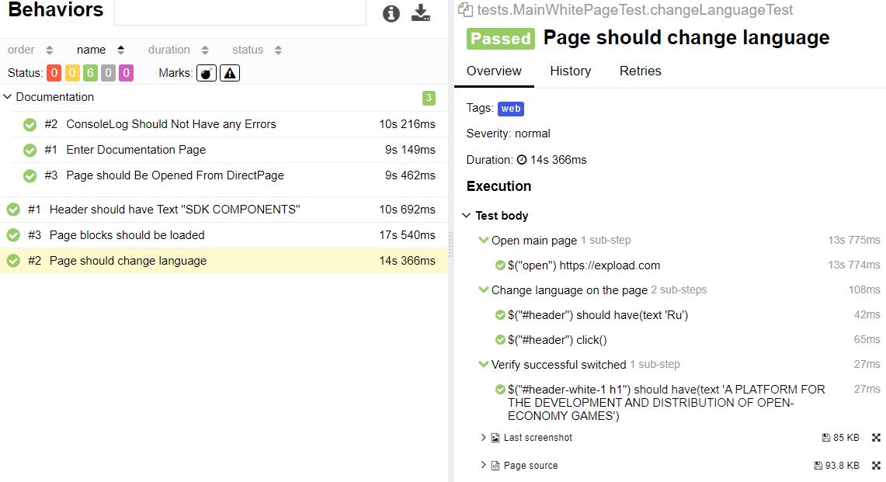
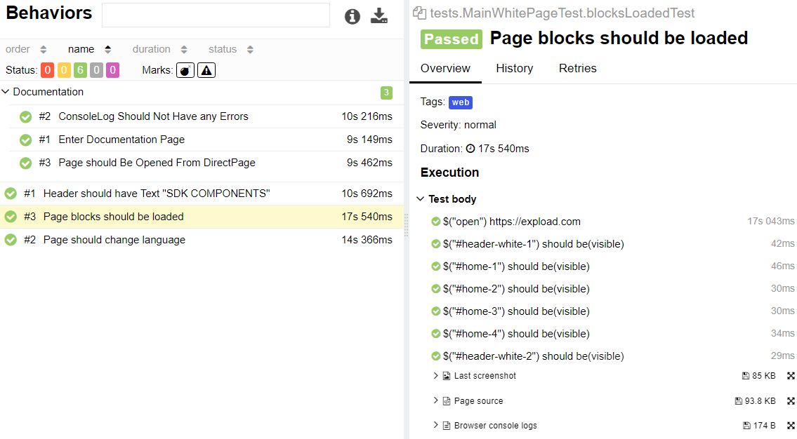
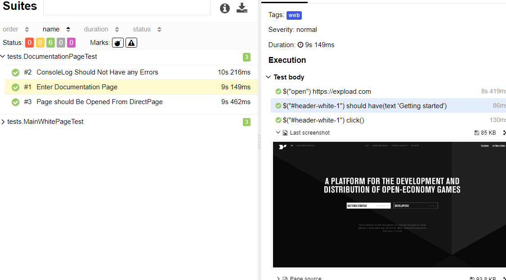
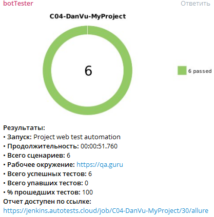

# Tests for expload.com website
## UI tests:
- Main page tests
- Page should Be Opened From DirectPage
- Console Log Should Not Have any Errors
- Header should have Text "SDK COMPONENTS"
- Page should change language EN/RU

## Technology Stack
**Java, Selenide, Rest-Assured, Junit5, Gradle, Allure Reports, Allure TestOps, Jenkins, Selenoid, Telegram Bot, Jira.**

## Screenshots
#### *Jenkins - it is an open source automation server:*

#### *Allure Report - it is a flexible lightweight test report tool:*

#### *Telegram notifications:*

#### *Allure TestOps - it is a TMS that allows to manage all test related stuff in one place:*